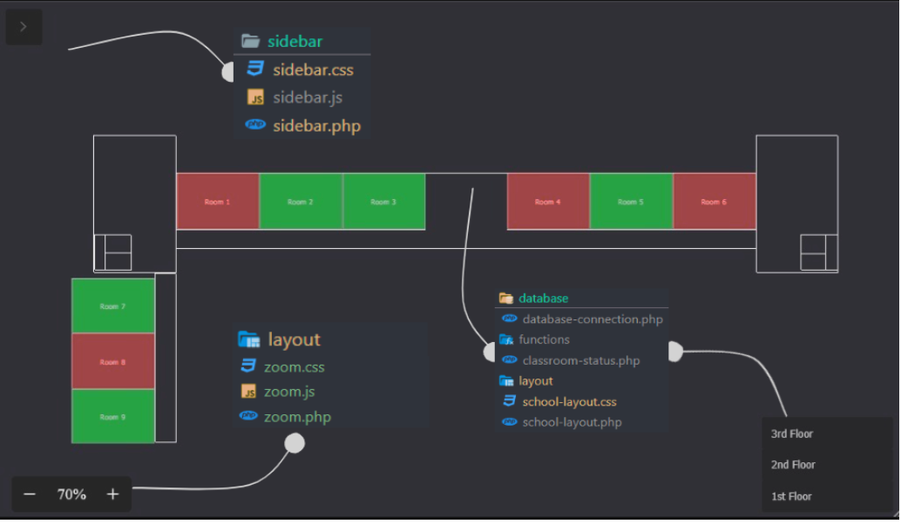

# [School Classroom Management System](https://github.com/Jgarette0/appsDev)

## Project Structure

The project is organized into the following folders:

- **database**
  - `database-connection.php`: Handles the connection to the MySQL database.

- **functions**
  - `classroom-status.php`: Displays the status of classrooms, showing green if vacant and red if occupied.

- **layout**
  - `school-layout.php`: Displays the school layout like a blueprint.
  - `school-layout.css`: Styles for the school layout.
  - `zoom.php`: Displays the school layout with zoom functionality.
  - `zoom.css`: Styles for the zoom layout.
  - `zoom.js`: JavaScript for zoom functionality.

- **sidebar**
  - `sidebar.php`: Displays a sidebar with the names of teachers.
  - `sidebar.css`: Styles for the sidebar.
  - `sidebar.js`: JavaScript for sidebar functionality.


- **mock**
  - Contains practice and mock micro-interactions and systems for development.



## Usage

1. Ensure a PHP server is set up.
2. Import the database using the SQL file provided in the `database` folder.
3. Configure the database connection in `database/database-connection.php`.
4. Open the application in a web browser.

## Features

- **Classroom Status:** `classroom-status.php` dynamically displays the status of classrooms.
- **School Layout:** `school-layout.php` and `zoom.php` provide visual representations of the school layout.
- **Sidebar:** `sidebar.php` displays a sidebar with teacher names.

## Contributing


Consider contributing our project, To get started, follow these steps:


1. **Fork the repository:** [Fork](https://github.com/Jgarette0/appsDev/fork) the repository to your GitHub account.


2. **Clone your fork:** Clone the repository from your account to your local machine.

    ```bash
    git clone https://github.com/YourGitHubUsername/appsDev.git
    ```

3. **Create a new branch:** Create a new branch for your contributions.

    ```bash
    git checkout -b your-branch-name
    ```

4. **Make your changes:** Make the necessary changes, add new features, or fix bugs.

5. **Commit your changes:** Commit your changes with a descriptive commit message.

    ```bash
    git add .
    git commit -m "Your descriptive commit message"
    ```

6. **Push your changes:** Push your changes to your fork on GitHub.

    ```bash
    git push origin your-branch-name
    ```

7. **Open a pull request:** Open a pull request on [GitHub](https://github.com/Jgarette0/appsDev/pulls) to propose your changes for review and inclusion in the main project.

Feel free to explore the code, fix bugs, add new features, or improve documentation. Your contributions are highly valued!

